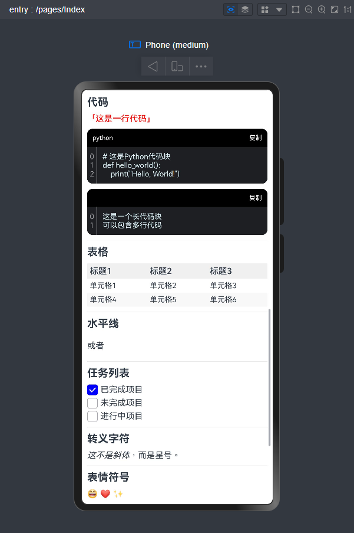

# HmdConv

> 1.0.2 需要 api12+，如需兼容api11，请使用1.0.1

## 简介

HmdConv 支持将html文本转换为markdown文本，目前支持的语法比较少，但功能已经足够使用，后续会继续添加支持的语法

## 下载安装

`ohpm install @rv/hmd-conv`

## 权限

无需权限

## 使用方式

```typescript
const md = new HmdConv().html2md("html")
```

目前支持的 html to markdown 的语法都是根据网站 [Markdown官方教程](https://markdown.com.cn/)中对应而来的，且有几项暂未支持：

- 转义字符与内嵌HTML
- 脚注
- 使用 Emoji 表情
- 自动网址链接

除了不支持的部分，还有不同语法标识同一功能的状况，这里也未做细分，如： 粗体可以使用 `**` 或 `——`，而我只实现了 `**`
，在后续的更新中将会加上可选项
如有不兼容的地方，可以提交 [Issuse](https://gitee.com/MUYS/hmd-conv/issues) ，带上你的 `html` 源码和生成的 `md` 文本

## tip

建议配合三方库 [@rv/markdown-preview](https://ohpm.openharmony.cn/#/cn/detail/@rv%2Fmarkdown-preview) ，因为也是我开发的


